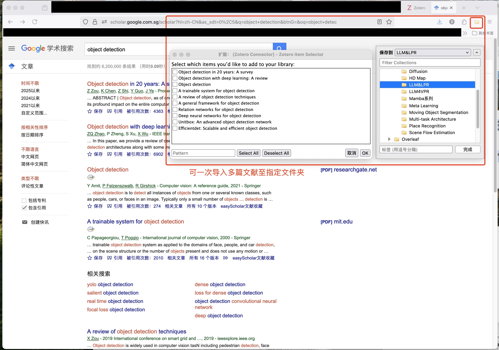
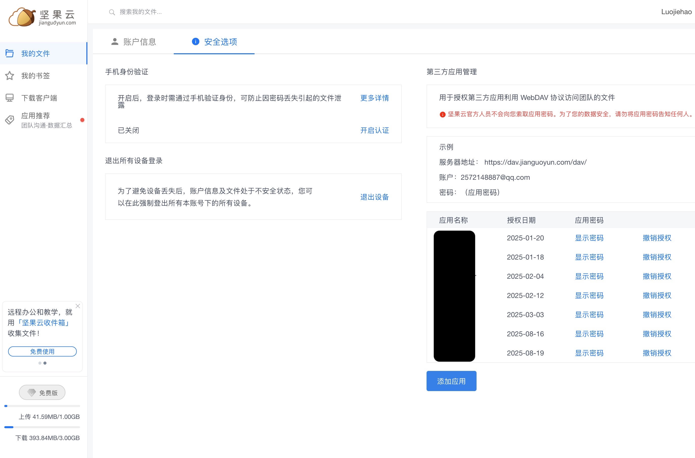

## 📚 Zotero 使用教程（GitHub 风格）

- 目录
  - [👋 简介](#-简介)
  - [🛠 安装与基础配置](#-安装与基础配置)
  - [🧩 安装浏览器插件：Firefox Zotero Connector](#-安装浏览器插件firefox-zotero-connector)
  - [⬇️ 从网页一键导入文献](#️-从网页一键导入文献)
  - [🌐 安装翻译插件（Zotero PDF Translate）](#-安装翻译插件zotero-pdf-translate)
  - [☁️ 用坚果云 WebDAV 同步附件（免费大容量、多端同步）](#️-用坚果云-webdav-同步附件免费大容量多端同步)
  - [🔁 多端使用与同步策略](#-多端使用与同步策略)
  - [📦 进阶插件（可选）](#-进阶插件可选)
  - [🧯 常见问题与排错](#-常见问题与排错)
  - [📝 速查表](#-速查表)

---

## 👋 简介
Zotero 是一款开源的学术文献管理工具，支持自动抓取网页元数据、PDF 全文、生成引用与参考文献，并可通过插件扩展功能。通过将附件同步到 WebDAV（如坚果云），可实现免费的大容量、跨设备同步。

- **官网**: [Zotero 官网](https://www.zotero.org)
- **适用场景**: 学位论文写作、科研笔记、团队文献库、LaTeX/Word 引用
- **亮点**: 一键抓取文献、自动管理 PDF、插件生态丰富、数据与附件分离式同步

Zotero 下载页（点击 Download）

---

## 🛠 安装与基础配置
1. 安装桌面端
   - 访问 [Zotero 下载页](https://www.zotero.org/download/) 并安装 Windows/macOS/Linux 版本。
2. 启动 Zotero 并登陆账户
   - 打开 Zotero → `Edit/Preferences` → `Sync`
   - 使用 Zotero 账户登录（用于同步元数据与条目信息；附件稍后改用 WebDAV）
3. 基础偏好设置
   - `General`:
     - 勾选 “Automatically attach associated PDFs when saving items” 以在保存条目时自动附加 PDF（若可获取）
     - 勾选 “Automatically take snapshots” 以保存网页快照（按需）
   - `Advanced → Files and Folders`:
     - 设置 `Base directory` 为你的 PDF/附件管理目录（可配合 ZotFile 等插件）

Zotero 偏好设置

---

## 🧩 安装浏览器插件：Firefox Zotero Connector
- 访问 [Zotero 下载页](https://www.zotero.org/download/) 安装 Firefox 的 “Zotero Connector”。
- 安装完成后，浏览器工具栏会出现 Zotero 小图标（书本/文件夹样式）。

验证：
- 浏览到文献页面（如 Google Scholar、ACM、IEEE Xplore）。
- 图标会根据页面内容变化（书本、文件夹、网页），表示可抓取类型。

Firefox 工具栏中的 Zotero Connector 图标

---

## ⬇️ 从网页一键导入文献
- 打开文献详情页 → 点击浏览器工具栏中的 Zotero 图标。
- 列表页会弹出对话框，可多选条目。
- Zotero 会尝试：
  - 抓取条目元数据（标题、作者、期刊、DOI 等）。
  - 自动下载并附加 PDF（若可获取）。
  - 保存网页快照（若启用）。

提示：
- 在 `Preferences → General` 中启用 PDF 自动附加可提升成功率。
- 如果站点需要机构访问，确保你已通过校园网/VPN 登录。

网页一键导入：图标变化与保存对话框

---

## 🌐 安装翻译插件（Zotero PDF Translate）
用于在 Zotero 内部直接对 PDF 进行划选翻译，支持多种服务（Google/Caiyun/DeepL 等）。

步骤：
1. 下载插件 `xpi` 包（示例：Zotero PDF Translate）。
   - 插件主页：[windingwind/zotero-pdf-translate](https://github.com/windingwind/zotero-pdf-translate)
2. 在 Zotero 中安装：
   - `Tools → Add-ons → gear icon → Install Add-on From File…`
   - 选择下载的 `.xpi` 文件并确认。
3. 配置翻译服务：
   - `Tools → Add-ons → PDF Translate → Preferences`
   - 选择翻译引擎，并根据需要填写 API Key（如 DeepL/Caiyun）。
4. 使用：
   - 打开 PDF → 选中文本 → 右侧/底部面板显示翻译结果（按插件 UI 而定）。

注意：
- 第三方翻译服务可能需要注册并获取 API Key。
- 合理使用免费额度，避免频繁请求。

PDF Translate 插件偏好设置界面

---

## ☁️ 用坚果云 WebDAV 同步附件（免费大容量、多端同步）
目标：用 Zotero 账户同步“数据/条目”，用坚果云 WebDAV 同步“附件文件”，实现低成本的海量存储与跨设备统一。

A. 准备坚果云 WebDAV
- 注册并登录坚果云。
- 在坚果云中新建一个专用文件夹（推荐名称：`Zotero`）。
- 依次点击用户名、账户信息、安全选项、添加应用，获取你的 WebDAV 信息（服务器地址/账户/密码）。
  - 一般 WebDAV 地址格式类似：`https://dav.jianguoyun.com/dav/你的文件夹名/`（以官方说明为准）。

B. 在 Zotero 中配置 WebDAV
1. 打开 Zotero → `Edit/Preferences → Sync`
2. Data Syncing（上半区）：
   - 登录你的 Zotero 账户用于同步元数据（条目、标签、笔记等）。
3. File Syncing（下半区）：
   - 勾选 “Sync attachment files in My Library using” → 选择 `WebDAV`。
   - `Server`: 填写坚果云 WebDAV 地址（指向新建的 `Zotero` 目录）。
   - `Username`/`Password`: 填入坚果云账号、应用专用密码。
   - 点击 “Verify Server” 验证。
   - 如需群组库附件也走 WebDAV，勾选对应选项。
4. 同步：
   - 右上角点击同步按钮，Zotero 将通过 WebDAV 上传/下载附件。

C. 目录结构与注意事项
- 附件将保存在 WebDAV 对应的 `Zotero/storage/` 子目录。

WebDAV 设置：服务器地址与 Verify Server

坚果云中的目录结构

---

## 🔁 多端使用与同步策略
- 桌面端（Win/macOS/Linux）：
  - 各设备均按上文配置：Zotero 账户同步“数据”，坚果云 WebDAV 同步“附件”。
  - 初次在新设备登录后，等待数据与附件完全拉取。
- 移动端：
  - iOS 版 Zotero 支持配置 WebDAV 同步附件（在 App 设置内登录并配置）。
  - Android 可通过第三方 PDF 工具+坚果云客户端查看附件（如无官方客户端时）。
- 团队/群组库：
  - 若需要群组库附件也走 WebDAV，在 `Sync → File Syncing` 中启用对应选项。

---

## 📦 进阶插件（可选）
- Better BibTeX（LaTeX 引用）：
  - 更稳定的 BibTeX 导出、自动生成引用键。
  - 仓库：[retorquere/zotero-better-bibtex](https://github.com/retorquere/zotero-better-bibtex)
- Mdnotes（笔记导出为 Markdown）：
  - 便于与 Obsidian/MD 笔记流整合。
- ZotFile（附件管理）：
  - 如需重命名/移动附件至自定义目录，可与 WebDAV 搭配，但需谨慎配置。

---

## 🧯 常见问题与排错
- 看不到浏览器图标/无法抓取：
  - 重新安装 Zotero Connector，或前往 [下载页](https://www.zotero.org/download/) 检查浏览器支持。
  - 某些站点需“机构访问/VPN”才能抓到元数据与 PDF。
- WebDAV “Verify Server” 失败：
  - 核对地址末尾斜杠与目录名，检查坚果云账号/密码/应用专用密码。
  - 先在坚果云网页端创建目标目录，再回到 Zotero 验证。
- 同步慢/失败：
  - 初次同步附件较多时需耐心等待；避免将 `Zotero 数据目录` 放进网盘同步。
- 翻译插件失效：
  - 检查 API Key、免费额度、代理设置；升级插件到最新版本。

---

## 📝 速查表
- 安装 Zotero + 登录账户（同步“数据”）。
- 安装 Firefox Zotero Connector（网页一键导入）。
- `General` 里启用自动附加 PDF。
- 安装翻译插件（Zotero PDF Translate）并配置翻译服务。
- 坚果云：
  - 新建 `Zotero` 文件夹 → 获取 WebDAV 地址。
  - Zotero `Sync → File Syncing` 选择 WebDAV → 填地址/账号 → `Verify Server`。
  - 开始同步，验证 `storage/` 是否有附件。
- 多端重复以上配置，保持一致。

祝你用 Zotero 高效管理文献，写作顺畅！🎉 